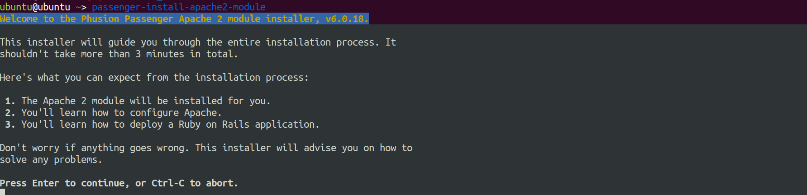

Install Redmine with Apache
==== 
## install dependencies 
```
# update & upgrade 
sudo apt-get update && sudo apt-get upgrade -y

# install required packages
sudo apt install -y apache2 ruby ruby-dev build-essential libapache2-mod-passenger libmysqlclient-dev

# if you want to install mysql server locally
sudo apt install -y mysql-server
```

## Run Redmine scripts
```
# generate secret token
bundle exec rake generate_secret_token

# migrate database
RAILS_ENV=production bundle exec rake db:migrate

# load default data
RAILS_ENV=production bundle exec rake redmine:load_default_data
``` 
## Configure Apache 
Create an apache configuration file in /etc/apache2/sites-available (e.g. redmine.conf) with the following content:

```
<VirtualHost *:80>
    ServerName redmine.example.com
    RailsEnv production
    DocumentRoot /opt/redmine/public

    <Directory "/opt/redmine/public">
            Allow from all
            Require all granted
    </Directory>

    ErrorLog ${APACHE_LOG_DIR}/redmine_error.log
        CustomLog ${APACHE_LOG_DIR}/redmine_access.log combined
</VirtualHost>
```
Install apache passenger module 
```
passenger-install-apache2-module
```


Edit apache configuration file to load passenger module 
```
#/etc/apache2/apache2.conf
LoadModule passenger_module /home/ubuntu/.rbenv/versions/3.0.6/lib/ruby/gems/3.0.0/gems/passenger-6.0.18/buildout/apache2/mod_passenger.so

```


If this is a new standalone installation, it will have created a default apache site. Disable it and enable the redmine config created above.
```
# disable default apache sites
sudo a2dissite 000-default.conf

# enable redmine
sudo a2ensite redmine.conf

# reload apache
sudo systemctl restart apache2
```


## Test Redmine 
Point your browser to the IP/DNS Name of the server and it should show the default Redmine screen.
Login with admin/admin

