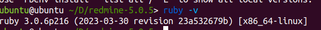
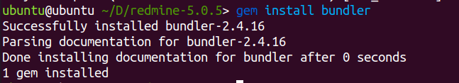

Migration process
=
install redmine 5.x

prerequisits: 

ruby on rail 3.0.6 
to install it in ubuntu you can follow this [tuto](https://www.digitalocean.com/community/tutorials/how-to-install-ruby-on-rails-with-rbenv-on-ubuntu-20-04)

# Ruby on rail


## Step 1 – Install rbenv and Dependencies
First, update your package list:

```
sudo apt update
```
Next, install the dependencies required to install Ruby:

```
sudo apt install git curl libssl-dev libreadline-dev zlib1g-dev autoconf bison build-essential libyaml-dev libreadline-dev libncurses5-dev libffi-dev libgdbm-dev
```
After installing the dependencies, you can install rbenv itself. Use curl to fetch the install script from Github and pipe it directly to bash to run the installer:
```
curl -fsSL https://github.com/rbenv/rbenv-installer/raw/HEAD/bin/rbenv-installer | bash
```
Next, add ~/.rbenv/bin to your $PATH so that you can use the rbenv command line utility. Do this by altering your ~/.bashrc file so that it affects future login sessions:
```
echo 'export PATH="$HOME/.rbenv/bin:$PATH"' >> ~/.bashrc
```
Then, add the command eval "$(rbenv init -)" to your ~/.bashrc file so rbenv loads automatically:
```
echo 'eval "$(rbenv init -)"' >> ~/.bashrc
```
Next, apply the changes you made to your ~/.bashrc file to your current shell session:

```
source ~/.bashrc
```
Verify that rbenv is set up properly by running the type command, which will display more information about the rbenv command:
```
type rbenv
```
Your terminal window will display the following:

```
Output
rbenv is a function
rbenv ()
{
    local command;
    command="${1:-}";
    if [ "$#" -gt 0 ]; then
        shift;
    fi;
    case "$command" in
        rehash | shell)
            eval "$(rbenv "sh-$command" "$@")"
        ;;
        *)
            command rbenv "$command" "$@"
        ;;
    esac
}
```
## Step 2 – Installing Ruby with ruby-build

With the ruby-build plugin now installed, you can install whatever versions of Ruby that you may need with a single command. First, list all the available versions of Ruby:

```
rbenv install -l
```
The output of that command will be a list of versions that you can choose to install:


Now let’s install Ruby 3.0.6:
```
rbenv install 3.0.6
```
Installing Ruby can be a lengthy process, so be prepared for the installation to take some time to complete.

Once it’s done installing, set it as your default version of Ruby with the global sub-command:
```
rbenv global 3.0.6
```
Verify that Ruby was properly installed by checking its version number:
```
ruby -v
```


## Step 3 – Working with Gems
Gems are the way Ruby libraries are distributed. You use the gem command to manage these gems, and use this command to install Rails.

When you install a gem, the installation process generates local documentation. This can add a significant amount of time to each gem’s installation process, so turn off local documentation generation by creating a file called ~/.gemrc which contains a configuration setting to turn off this feature:
```
echo "gem: --no-document" > ~/.gemrc
```
Bundler is a tool that manages gem dependencies for projects. Install the Bundler gem next, as Rails depends on it:

```
gem install bundler
```
You’ll receive the following output:



You can use the gem env command (the subcommand env is short for environment) to learn more about the environment and configuration of gems. You can confirm where gems are being installed by using the home argument, like this:

```
gem env home
```

## Step 4 – Installing Rails
To install Rails, use the gem install command along with the -v flag to specify the version.

```
gem install rails -v 6.1.4.1
```
rbenv works by creating a directory of shims, which point to the files used by the Ruby version that’s currently enabled. Through the rehash sub-command, rbenv maintains shims in that directory to match every Ruby command across every installed version of Ruby on your server. Whenever you install a new version of Ruby or a gem that provides commands as Rails does, you should run the following:
```
rbenv rehash
```


# Install MySQL
## Step 1 — Installing MySQL
```
sudo apt update
```

Then install the mysql-server package:
```
sudo apt install mysql-server
```
Ensure that the server is running using the systemctl start command:
```
sudo systemctl start mysql.service
```
## Step 3 — Creating a Dedicated MySQL User and Granting Privileges

In Ubuntu systems running MySQL 5.7 (and later versions), the root MySQL user is set to authenticate using the auth_socket plugin by default rather than with a password. This plugin requires that the name of the operating system user that invokes the MySQL client matches the name of the MySQL user specified in the command, so you
To install it, update the package index on your server if you’ve not done so recently:

```
sudo mysql
```
Once you have access to the MySQL prompt, you can create a new user with a CREATE USER statement. These follow this general syntax:
```
CREATE USER 'username'@'host' IDENTIFIED WITH authentication_plugin BY 'password';
```
After creating your new user, you can grant them the appropriate privileges. The general syntax for granting user privileges is as follows:

```
GRANT PRIVILEGE ON database.table TO 'username'@'host';
```

Install Redmine
====
## Step 1 - Redmine application¶

Download a released package and extract it to an appropriate destination on your system.
As an alternative one can checkout the files directly from the version control system.
```
wget https://www.redmine.org/releases/redmine-5.0.5.tar.gz
```

## Step 2 - Create an empty database and accompanying user
```
CREATE DATABASE redmine CHARACTER SET utf8mb4;
CREATE USER 'redmine'@'localhost' IDENTIFIED BY 'my_password';
GRANT ALL PRIVILEGES ON redmine.* TO 'redmine'@'localhost';
```
## Step 3 - Database connection configuration
### Edit the database configuration file
```
# copy the example file
cd /opt/redmine
cp config/database.yml.example config/database.yml

# edit config file with your editor of choice (mine is vi)
vi config/database.yml
```

Replace or update the production: block with your configuration. One example based on the mysql config above.
```
production:
  adapter: mysql2
  database: redmine
  host: localhost
  username: redmine
  password: "my_password" 
```
## Step 4 - Dependencies installation
```
gem install bundler
```
Then you can install all the gems required by Redmine using the following command:

**note**: you must be above config directory  
```
bundle config set --local without 'development test' 
bundle install
```

if mysql2 failed to install you need to add dependancies by following this command:
``` 
sudo apt-get install libmysqlclient-dev
```
## Step 5 - Session store secret generation

This step generates a random key used by Rails to encode cookies storing session data thus preventing their tampering.
Generating a new secret token invalidates all existing sessions after restart.
```
bundle exec rake generate_secret_token
``` 

## Step 6 - Database schema objects creation

Create the database structure, by running the following command under the application root directory:

```
RAILS_ENV=production bundle exec rake db:migrate
```

## Step 7 - Database default data set
Insert default configuration data in database, by running the following command:

```
RAILS_ENV=production bundle exec rake redmine:load_default_data
```

## Step 8 - File system permissions
The user account running the application must have write permission on the following subdirectories:

files (storage of attachments)
log (application log file production.log)
tmp and tmp/pdf (create these ones if not present, used to generate PDF documents among other things)
public/plugin_assets (assets of plugins)
assuming the username and group is redmine/redmine

```
mkdir -p tmp tmp/pdf public/plugin_assets
sudo chown -R redmine:redmine files log tmp public/plugin_assets
sudo chmod -R 755 files log tmp public/plugin_assets
```
## Step 9 - Test the installation

Test the installation by running WEBrick web server:

```
bundle exec rails server webrick -e production
```


